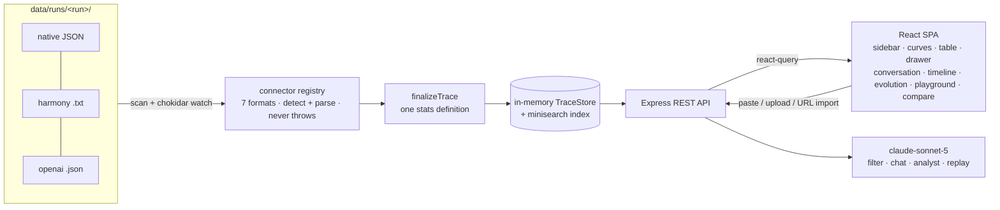

# Trace Viewer

A local-first web tool for loading, reading, and debugging LLM traces from RL post-training
runs. When something breaks — a bad tool call, a wrong answer, a slow turn, a reward that never
moves — you open this, find the rollout, and read exactly what the model did and why.

> Langfuse-class platforms answer *"how is my app doing in production"*; this tool answers
> *"why did this rollout go wrong."* Single-trace comprehension for researchers: chat-first,
> checkpoint-aware, zero-infra, and code-agent-native (bash / editor / test-runner calls are
> first-class citizens, not generic spans).

## Quick start

Requires **Node ≥ 20**. One command:

```bash
./setup.sh          # installs deps, generates the example corpus, starts the app
```

Or manually:

```bash
npm install
npm run generate:all   # creates the example corpus (deterministic; ~650 traces / 4 runs)
npm run dev            # API on :8787 + web on :5173
```

Open **http://localhost:5173** and pick a run from the sidebar to load it. No API keys required;
see [AI features](#ai-features) for the optional ones. (The generator is shipped, not the
~30 MB corpus — `generate:all` creates it locally in one step.)

Production mode (single port):

```bash
npm run build && npm start   # serves the built SPA + API on :8787
```

### ACE cockpit

When a sibling `../ac_express` checkout exists, the server automatically adds
`ac_express/data` as the `production` corpus and `ac_express/runs/episodes` as simulation runs.
No copy or manual import is required. The ACE-specific entry points are:

- `/ace` — launch/control runs and inspect batch failures;
- `/ace/analysis` — aggregate one or multiple exact run IDs with a shareable URL;
- `/ace/tasks` — browse the current scenario goals and constraints with source digests;
- `/ace/lab` — rerun one task with explicit model/prompt/harness/fault settings and monitor it live;
- `/reviews` — blind Calibration or Assisted human labeling;
- any simulation trace → `Replay & Fork` for checkpoint restore/fork, when its archive exists;
- any ACE trace/prefix → save an immutable regression artifact (runnable only when the trace
  carries its own scenario snapshot; otherwise an explicit non-runnable draft).

Calibration treats only a trace-bound scenario snapshot as authoritative ground truth. Older
runs without one show that ground truth is unavailable; the current Task Explorer definition is
never silently substituted for a historical contract.

Production transcripts are not sent to external AI features unless
`ACE_ALLOW_EXTERNAL_AI=1` is explicitly set. The server binds to `127.0.0.1` by default.

## 30-second tour

1. **Home** — left sidebar holds selection stats, the *Categories & datasets* tree
   (checkbox multi-select filters), all trace filters, and drag-and-drop import. The main pane
   shows reward-by-checkpoint curves (click a point to filter that step), the per-component
   analytics table, and the trace table. Click any row → a resizable preview drawer slides in.
2. **Read a failure** — open `swebench-i06-s50-r01`: the conversation shows a **malformed
   tool-call JSON** in a loud red block, followed by the error result. The step-grouped cards
   keep reasoning collapsed inside each response; `Expand all / Collapse all` in the toolbar.
3. **Profile a slow trace** — toggle **Timeline** in the conversation toolbar: a two-pane
   profiling view with the span tree (turns → model / sandbox / grader spans, proportional
   duration bars, exceptions in red) on the left and the selected span's message on the right.
4. **Ask why** — the home **AI analysis** panel runs an agent over the corpus
   ("why do swe traces time out?"), and every trace page has **Ask AI** chat plus a
   **LLM-only continuation** tab that sends a prompt prefix to a stand-in model. It is deliberately
   separate from ACE checkpoint replay.
5. **Inspect tokens** — in any assistant message switch to the **Tokens** view: confidence-
   colored token chips, per-token id / logprob / top-k alternatives.
6. **Share** — every view state (filters, sort, tab, selected trace, peek drawer) lives in the
   URL. Copy the address bar; that *is* the share link.

## Example traces & connectors

The committed corpus is deterministic synthetic data shaped after real datasets
(DeepScaleR math, Nemotron science, SWE-bench Verified, terminal-bench, LeetCode,
BrowseComp) with realistic failure modes: tool timeouts + retries, malformed tool JSON,
truncation, budget exhaustion, cancelled runs, wrong answers — plus one 3.5 MB / 400-turn
stress trace and one deliberately corrupt file (the scanner must survive it).

Seven **connectors** parse input formats (auto-detected; adding a format = one file +
one registry entry in `shared/connectors/`):

| Connector | Input |
|---|---|
| `native` | this tool's normalized trace JSON / JSONL |
| `openai-chat` | OpenAI Chat Completions JSON |
| `openai-responses` | OpenAI Responses API JSON (`output` items, reasoning, function calls) |
| `anthropic-messages` | Anthropic Messages API JSON (content blocks, `tool_use`/`tool_result`, extended `thinking`) |
| `agent-conversation` | `{conversation: [...]}` multi-agent support transcripts (per-message `agent_type`, object tool-call args, unix timestamps; salvages truncated files) |
| `qwen-generic` | Qwen/DeepSeek `reasoning_content`, or a bare `[{role, content}]` list |
| `harmony` | raw OpenAI-harmony token text (`<\|start\|>…<\|message\|>…<\|end\|>`) |

`examples/` holds one importable fixture per format (plus richer ones — a ~99-message
agentic session, heavy Markdown/LaTeX, and full Anthropic/OpenAI metadata) for exercising
the **Import a trace** dialog.

**Import is load-and-view**: paste text / upload a file / fetch a URL, and the imported
trace opens in a side drawer (the home view stays put, so you can keep importing/loading).
Imports are held in memory only (re-importing just refreshes) — for a persistent corpus, drop
files into `data/runs/<run>/` and the server watches + rescans.

### Load a corpus outside the repository

Keep large or private traces where they already live. While the viewer is running, open
**Import → Folder**, enter an absolute directory (plus an optional run label), and choose
**Add & watch**. Existing files are indexed immediately and later changes are watched without a
restart. The folder is restored after a server restart from the private local registry below.

Folders added through the UI are saved in the git-ignored machine-local
`.trace-viewer/data-roots.json` registry and restored on startup. You can also manage startup
folders explicitly in `.env`:

```bash
TRACE_DATA_ROOTS=work-trial=/Users/you/Downloads/data
```

Restart `npm run dev`, then select `work-trial` in the run picker. The built-in
`data/runs` and `data/imported` roots remain enabled; configured roots are additive and are
watched with the same live-reload behavior. Multiple roots use the platform path delimiter:
`:` on macOS/Linux and `;` on Windows.

The `work-trial=` prefix is an explicit run label. It is recommended for generic directory
names such as `data`; without a label, a direct external corpus uses its directory basename as
the run name instead of silently appearing under `imported`. Relative paths are resolved from
the repository root, regardless of the directory from which the server was launched. If two
folders have the same basename, the second must be given a unique label so their trace identities
cannot collide.

Private `data/runs/work-trial` files remain intentionally ignored by Git and are not included in
a push or a fresh clone. Configure `TRACE_DATA_ROOTS` on each machine (or mount the corpus in a
deployment) instead of committing received traces.

### Tailnet access

`npm run serve:tailscale` keeps the API private on `127.0.0.1`, detects this machine's Tailscale
IPv4 address, and binds only the Vite frontend to that address on port `5173`. It prints the exact
Tailnet-only IP URL and, when MagicDNS is enabled, a stable machine-name URL at startup. The
detected MagicDNS host is added to Vite's allowlist without opening the listener beyond the
Tailscale interface. Use a service manager such as a macOS LaunchAgent when the process
must survive terminal closure or login restarts; the supervisor exits if either child fails so the
service manager can restart the complete pair.

The status bar's **data roots** menu shows each root's scan state, file/trace counts, and warning
count. The same aggregate-only diagnostics are available from `GET /api/meta`; paths are shown
only as project/home-relative or basename labels, and no file or trace contents are included.

Regenerate the corpus (byte-identical for a given seed):

```bash
npm run generate:all     # all runs (run-a…run-d) into data/runs/<run>/
npm run generate         # run-a only (seed 42)
```

## AI features

Optional — everything degrades gracefully without a key:

```bash
cp .env.example .env    # set ANTHROPIC_API_KEY
```

| Feature | With key | Without key |
|---|---|---|
| Natural-language filter | claude-sonnet-5 → filter DSL ("AI" badge) | deterministic rule parser ("rules" badge) |
| Trace chat ("Ask AI") | full-trace Q&A | clear 503 hint |
| AI analysis agent | tool-use loop over the corpus | clear 503 hint |
| LLM-only continuation | stand-in model simulation | clear 503 hint |

## Scripts

| Command | What it does |
|---|---|
| `npm run dev` | tsx watch API (:8787) + Vite (:5173, `/api` proxied) |
| `npm run serve:tailscale` | supervised dev API + frontend bound only to this machine's Tailnet IP |
| `npm run build` / `npm start` | typecheck + build; production single-port serve |
| `npm run generate:all` / `npm run generate` | regenerate the corpus (all runs / run-a), seeded + deterministic |
| `npm run test:e2e` | deterministic Playwright cockpit workflows (all APIs mocked; no provider spend) |
| `npm test` / `npm run lint` / `npm run check` | vitest (821 tests) / biome / everything |

## Architecture



```
shared/      pure-TS contract: schema, connectors, stats, filter DSL (used by server + web)
server/      Express API: store, scan/watch, search, import (SSRF-guarded), AI endpoints
src/         React app: home (sidebar/curves/components/table/drawer), trace views, compare
generator/   deterministic synthetic-corpus CLI (scenarios, failures, logprobs, spans)
data/runs/   committed example corpus (run-a…run-d)
examples/    importable fixtures, one per connector format (+ richer samples)
scripts/     ui-debug.ts (Playwright QA harness), make-examples.ts (fixture generator)
```

Design decisions, trade-offs, failure-mode handling and non-goals are written up in
**[REPORT.md](REPORT.md)**; the development log lives in [progress.md](progress.md).

## AI tooling disclosure

This project was built with **Claude Code** (Anthropic) driving implementation under my
direction: I set the product design, layouts (hand sketches), data model, milestones and
acceptance criteria, reviewed every iteration in the browser, and steered via continuous
feedback; the assistant parallelized implementation, testing and QA. Reference materials:
the OpenAI harmony format docs and public dataset cards named above.
