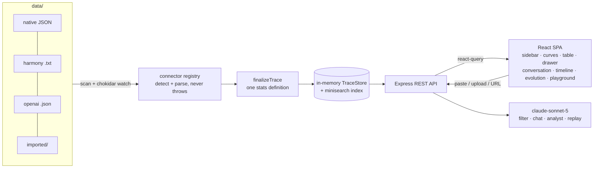

# Trace Viewer

A local-first web tool for loading, reading, and debugging LLM traces from RL post-training
runs. When something breaks — a bad tool call, a wrong answer, a slow turn, a reward that never
moves — you open this, find the rollout, and read exactly what the model did and why.

> Langfuse-class platforms answer *"how is my app doing in production"*; this tool answers
> *"why did this rollout go wrong."* Single-trace comprehension for researchers: chat-first,
> checkpoint-aware, zero-infra, and code-agent-native (bash / editor / test-runner calls are
> first-class citizens, not generic spans).

## Quick start

Requires **Node ≥ 20**.

```bash
npm install
npm run dev        # API on :8787 + web on :5173 (one command, no other setup)
```

Open **http://localhost:5173** — the app boots with a committed example corpus
(~1,200 traces across two simulated training runs) already loaded. No API keys required;
see [AI features](#ai-features) for the optional ones.

Production mode (single port):

```bash
npm run build && npm start   # serves the built SPA + API on :8787
```

## 30-second tour

1. **Home** — left sidebar holds selection stats, the *Categories & datasets* tree
   (checkbox multi-select filters), all trace filters, and drag-and-drop import. The main pane
   shows reward-by-checkpoint curves (click a point to filter that step), the per-component
   analytics table, and the trace table. Click any row → a resizable preview drawer slides in.
2. **Read a failure** — try `termbench-i08-s255-r03`: the conversation shows a **malformed
   tool-call JSON** in a loud red block, followed by the error result. The step-grouped cards
   keep reasoning collapsed inside each response; `Expand all / Collapse all` in the toolbar.
3. **Profile a slow trace** — open any trace's **Timeline** tab: a nested span tree
   (turns → model / sandbox / grader spans) with proportional bars, status dots, and a
   span-detail panel (exceptions surface in red). The conversation view also has a vertical
   **minimap** (toolbar → Timeline) for jump-navigation by turn duration.
4. **Ask why** — the home **AI analysis** panel runs an agent over the corpus
   ("why do swe traces time out?"), and every trace page has **Ask AI** chat plus a
   **Playground** tab that replays a prompt prefix against a stand-in model.
5. **Inspect tokens** — in any assistant message switch to the **Tokens** view: confidence-
   colored token chips, per-token id / logprob / top-k alternatives.
6. **Share** — every view state (filters, sort, tab, selected trace, peek drawer) lives in the
   URL. Copy the address bar; that *is* the share link.

## Example traces & connectors

The committed corpus is deterministic synthetic data shaped after real datasets
(DeepScaleR math, Nemotron science, SWE-bench Verified, terminal-bench, LeetCode,
BrowseComp) with realistic failure modes: tool timeouts + retries, malformed tool JSON,
truncation, budget exhaustion, cancelled runs, wrong answers — plus one 3.5 MB / 400-turn
stress trace and one deliberately corrupt file (the scanner must survive it).

Three **connectors** parse input formats (auto-detected; adding a format = one file +
one registry entry in `shared/connectors/`):

| Connector | Input | Example |
|---|---|---|
| `native` | normalized trace JSON / JSONL | `data/traces/native/**` |
| `harmony` | raw OpenAI-harmony token text (`<\|start\|>…<\|message\|>…<\|end\|>`) | `data/traces/harmony/*.txt` |
| `openai-chat` | chat-completions request/response JSON | `data/traces/openai/*.json` |

Load more traces four ways: drop files on the sidebar **Import** zone, paste text /
upload / fetch a URL via the Import dialog, or drop files into `data/` (the server watches
and rescans). Imports persist under `data/imported/`.

Regenerate the corpus (byte-identical for a given seed):

```bash
npm run generate                                                    # run-a, seed 42
npx tsx generator/generate.ts --seed 43 --run run-b --scale 0.5 \
  --out data/traces_runb                                            # second run for /compare
```

## AI features

Optional — everything degrades gracefully without a key:

```bash
cp .env.example .env    # set ANTHROPIC_API_KEY
```

| Feature | With key | Without key |
|---|---|---|
| Natural-language filter | claude-sonnet-5 → filter DSL ("AI" badge) | deterministic rule parser ("rules" badge) |
| Trace chat ("Ask AI") | full-trace Q&A | clear 503 hint |
| AI analysis agent | tool-use loop over the corpus | clear 503 hint |
| Playground replay | stand-in model simulation | clear 503 hint |

## Scripts

| Command | What it does |
|---|---|
| `npm run dev` | tsx watch API (:8787) + Vite (:5173, `/api` proxied) |
| `npm run build` / `npm start` | typecheck + build; production single-port serve |
| `npm run generate` | regenerate the example corpus (seeded, deterministic) |
| `npm test` / `npm run lint` / `npm run check` | vitest (≈260 tests) / biome / everything |

## Architecture



```
shared/      pure-TS contract: schema, connectors, stats, filter DSL (used by server + web)
server/      Express API: store, scan/watch, search, import (SSRF-guarded), AI endpoints
src/         React app: home (sidebar/curves/components/table/drawer), trace views
generator/   deterministic synthetic-corpus CLI (scenarios, failures, logprobs, spans)
data/        committed example corpus (two runs) + imported/ (runtime)
scripts/     ui-debug.ts — headless Playwright harness used for development QA
```

Design decisions, trade-offs, failure-mode handling and non-goals are written up in
**[REPORT.md](REPORT.md)**; the development log lives in [progress.md](progress.md).

## AI tooling disclosure

This project was built with **Claude Code** (Anthropic) driving implementation under my
direction: I set the product design, layouts (hand sketches), data model, milestones and
acceptance criteria, reviewed every iteration in the browser, and steered via continuous
feedback; the assistant parallelized implementation, testing and QA. Reference materials:
the OpenAI harmony format docs and public dataset cards named above.
